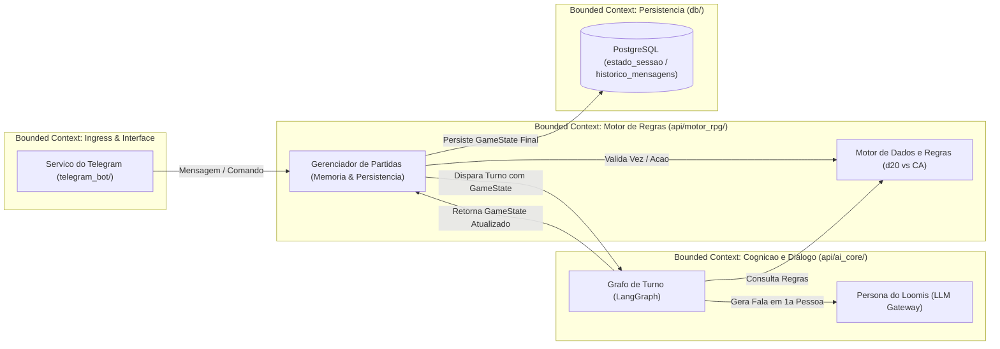
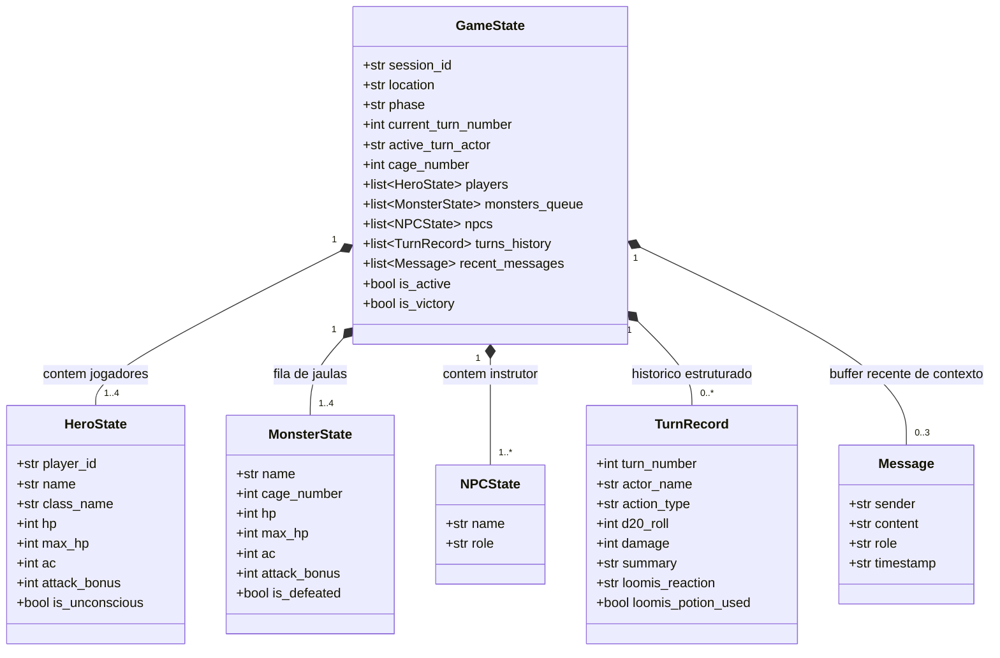
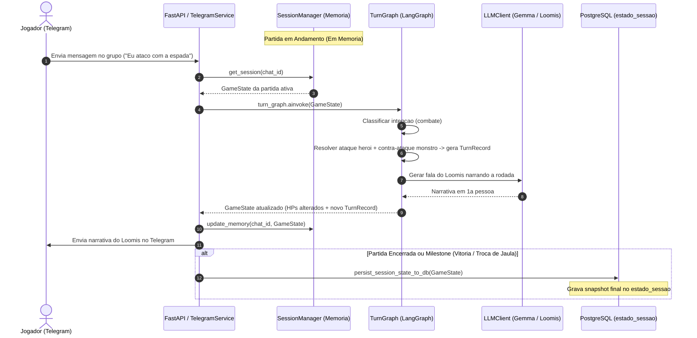
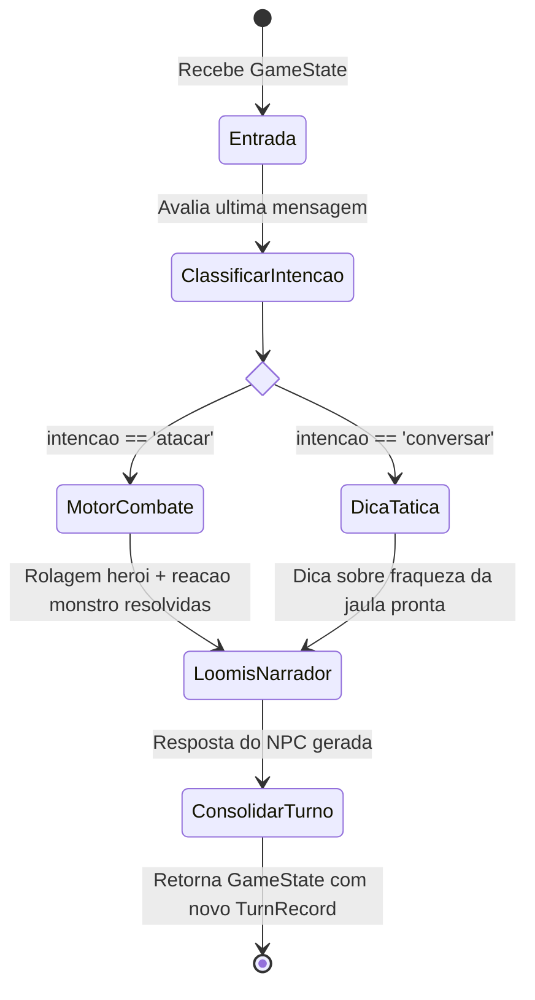

# Arquitetura do Sistema: AI-NPC (The Heroes of Hesiod)

Este documento detalha a arquitetura de ponta a ponta, a modelagem de domínio orientada a DDD (Domain-Driven Design), os princípios SOLID aplicados e o ciclo de vida dos fluxos do sistema de NPC Conversacional para Telegram e IA.

---

## 1. Visao Geral e Bounded Contexts (DDD)

O sistema e estruturado em tres Bounded Contexts com responsabilidades estritamente delimitadas:

### Definicao dos Contextos Delimitados:
1. **Contexto de Interface (Telegram):** Recebe webhooks, decodifica remetentes (`chat_id`, `user_id`) e despacha mensagens formatadas ao grupo.
2. **Contexto do Motor RPG (Dominio de Regras):** Arbitro deterministico das regras de Hesiod (dados, vida, armadura, ordem de turnos, onboarding e pocao de cura).
3. **Contexto Cognitivo (Dominio de IA):** Modela a cognicao do NPC Loomis via LangGraph, classificando intencoes e gerando narrativa em 1a pessoa.
4. **Contexto de Persistencia:** Armazenamento relacional e documental do `GameState` agregado no PostgreSQL.

---

## 2. Modelagem de Dominio (Domain Model & SOLID)

Seguindo DDD e o principio de responsabilidade unica (SRP), o modelo distingue o **Aggregate Root (`GameState`)**, suas **Entidades filhas** e os **Value Objects**:

### Responsabilidades dos Elementos de Dominio:
* **`GameState` (Aggregate Root):** O estado consolidado da partida. Controla o ciclo macro (`phase`: `"onboarding"`, `"combat"`, `"victory"`). Representa exatamente o que a tabela `estado_sessao.variaveis_jogo` armazena no banco de dados.
* **`HeroState` e `MonsterState` (Entidades):** Possuem ciclo de vida e estado mutavel durante o combate (HP, status de derrota/inconsciencia).
* **`TurnRecord` (Value Object Imutavel):** Registro estruturado da jogada realizada (quem agiu, quanto tirou no dado, quanto dano causou, se Loomis arremessou pocao e a reacao narrativa). Fica armazenado na lista `turns_history` do `GameState`.
* **`recent_messages` (Buffer Deslizante):** Mantem estritamente as ultimas 3 mensagens no `GameState` para fornecer contexto conversacional imediato ao LangGraph, sem inflar a memoria RAM nem desperdicar tokens. O historico completo e persistido na tabela `historico_mensagens` do PostgreSQL.

---

## 3. Dinamica de Ciclo de Vida: Memoria vs. Banco de Dados

Para evitar sobrecarga de transacoes no banco a cada micro-interacao e garantir performance em tempo real no Telegram:

### Politica de Persistencia:
1. **Em Andamento (Hot Path):** O `GameState` e mantido e operado em cache de memoria (`_MEMORY_SESSIONS`) pelo `session_service` durante as trocas rapidas de mensagens.
2. **Ao Concluir a Partida / Fim de Sessao (Cold Path):** O `GameState` agregado (contendo os status finais dos herois, monstros derrotados e a lista de `turns_history`) e persistido de forma atomica no PostgreSQL dentro de `estado_sessao.variaveis_jogo`.
3. **Persistencia de Seguranca:** Apos cada rodada fechada (quando todos os herois e o monstro agiram), uma gravacao assincrona no banco garante a recuperacao de desastres caso o container reinicie.

---

## 4. Dinamica de Jogo: Onboarding, Turno Encadeado e Regras de Hesiod

O sistema opera orientado a eventos conforme as regras canônicas de *The Heroes of Hesiod*:

### 4.1. Fase de Onboarding e Escolha de Personagens (`phase = "onboarding"`)
1. **Comando `/start`:** Loomis da as boas-vindas na clareira de Hesiod e apresenta os 5 herois disponiveis:
   * **Jorick:** Guerreiro Humano (CA 13, HP 5, Espada Larga 1d20+4).
   * **Raen:** Barbara Ana (CA 9, HP 7, Machado Pesado 1d20+5).
   * **Bet:** Maga Elfa (CA 7, HP 4, Bola de Fogo 1d20+7).
   * **Evindol:** Ladino Humano (CA 11, HP 3, Laminas 1d20+6).
   * **Yarrow:** Xama Meio-Orc (CA 10, HP 6, Espiritos 1d20+3).
2. **Selecao de Herois:** Os jogadores no grupo escolhem seus arqueticos (ate 4 jogadores).
3. **Inicio do Combate:** Loomis entrega as armas respectivas, destranca a Jaula 1 (*Bullette Faminto*), transiciona `phase = "combat"` e passa a vez para o primeiro jogador.

### 4.2. O Turno Encadeado de Combate (Acao do Heroi + Reacao do Monstro)
O monstro nao e um participante com conta no Telegram; sua acao ocorre de forma **encadeada e automatica**:
1. O heroi cujo turno esta ativo envia sua acao (ataque ou pergunta tatica).
2. O motor calcula o golpe do heroi: `d20 + bonus >= CA_alvo`.
3. Se o monstro for atingido, deduz-se o HP.
4. **Contra-ataque Imediato da Criatura:** Se o monstro continuar vivo apos o golpe, o motor calcula na mesma hora o ataque do monstro contra um dos herois ativos.
5. **Narracao Unificada do Loomis:** O LangGraph sintetiza em 1a pessoa toda a sequencia do turno:
   * O golpe do heroi (acerto/erro e impacto).
   * A investida violenta do monstro em resposta.
   * A chamada para o proximo heroi da fila agir.

### 4.3. Regras Especiais de Hesiod
* **A Pocao de Loomis (Zero Frustracao):**
  * Quando o ataque de um monstro reduz o HP de um heroi a 0, o heroi cai inconsciente.
  * Loomis interrompe a cena, grita para o aluno se levantar e arremessa sua famosa pocao com sabor de menta e limao, restaurando imediatamente a vida maxima do heroi.
  * O heroi nao perde a vez e continua no combate.
* **Gatilho de 50% de HP da Jaula:**
  * Se houver apenas uma criatura na clareira e seu HP cair para 50% ou menos, Loomis pode destrancar a jaula seguinte para elevar o desafio do treino.
* **Vitoria:**
  * Apos as 4 jaulas serem superadas (Bullette, Beholder, Dragao Vermelho e Pixies), Loomis declara vitoria, concede a insignia de **Heroi de Hesiod** e encerra a partida.

---

## 5. Ciclo Cognitivo no LangGraph (`turn_graph.py`)

A execucao de cada requisicao no LangGraph segue a maquina de estados de turno:

### Nos do Grafo:
* **`classify_intent_node`:** Identifica o objetivo da acao (ataque físico/magico versus duvida/conselho).
* **`combat_node`:** Executa o cálculo determinístico das regras (d20 + bônus versus CA do monstro, contra-ataque da criatura e checagem de poção de cura). Gera o `TurnRecord`.
* **`tactical_advice_node`:** Consulta as fraquezas da criatura atual nas regras de Hesiod e monta a instrucao pedagogica.
* **`npc_node` (Loomis):** Recebe o contexto do turno e sintetiza o dialogo em 1a pessoa com o `LLMClient`.
