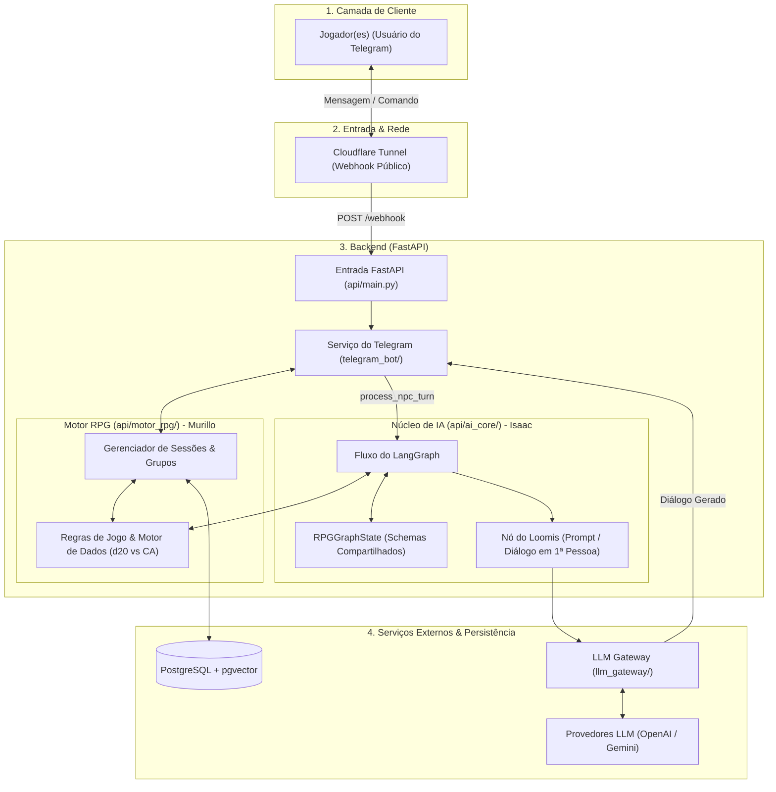
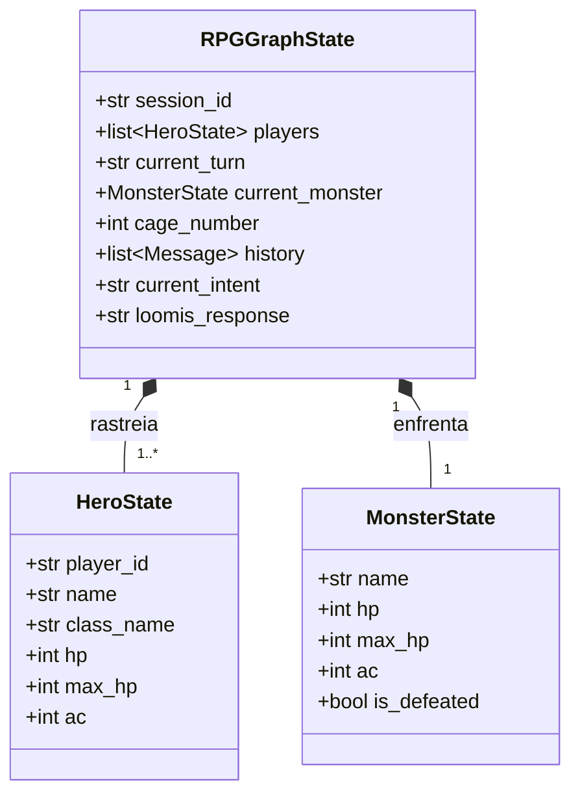
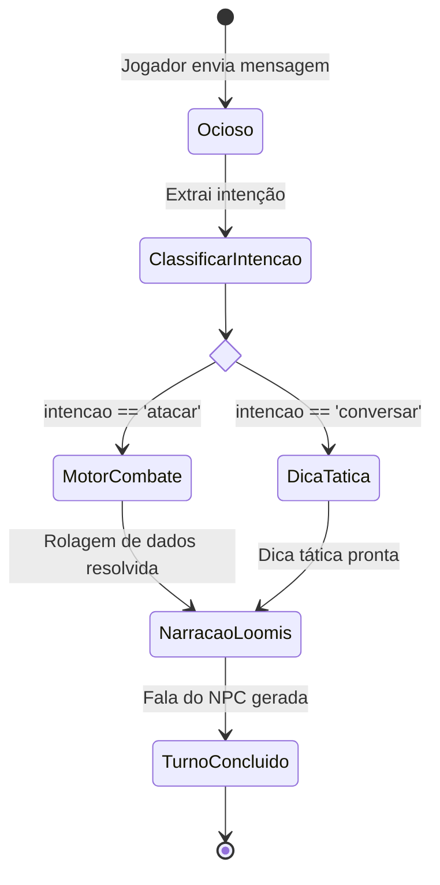

# Arquitetura do Sistema: AI-NPC (The Heroes of Hesiod)

Este documento detalha a arquitetura de ponta a ponta, a modelagem de estado e o ciclo de vida dos fluxos do sistema de NPC Conversacional integrado com Telegram e IA.

---

## 1. Arquitetura de Ponta a Ponta

O diagrama a seguir detalha a interação entre os jogadores no Telegram, o túnel de rede, a aplicação FastAPI, o motor determinístico de RPG, o núcleo de IA (LangGraph) e o banco de dados:

---

## 2. Modelagem de Estado (`RPGGraphState`)

A estrutura de dados a seguir suporta tanto partidas individuais (*single-player*) quanto sessões cooperativas (*multiplayer*):

### Dinâmica de Turnos e Rodadas (*Turns vs. Rounds*)
* **`current_turn`:** Identifica quem possui a vez de agir (o `player_id` do herói da vez ou `"monster"`).
* **Turno (*Turn*) vs. Rodada (*Round*):**
  * **Turno:** A janela de ação individual de um participante (o golpe de um jogador ou a investida do monstro). Loomis reage e narra imediatamente a cada turno no Telegram para garantir retorno instantâneo.
  * **Rodada:** O ciclo completo após **todos** os participantes (todos os heróis ativos do grupo + a criatura da jaula) terem executado seus turnos.

---

## 3. Ciclo de Vida e Transições no LangGraph

O fluxo de execução de uma requisição pelo grafo cognitivo do Loomis:

