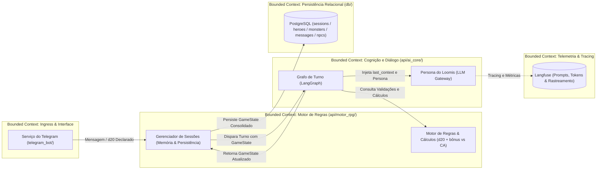
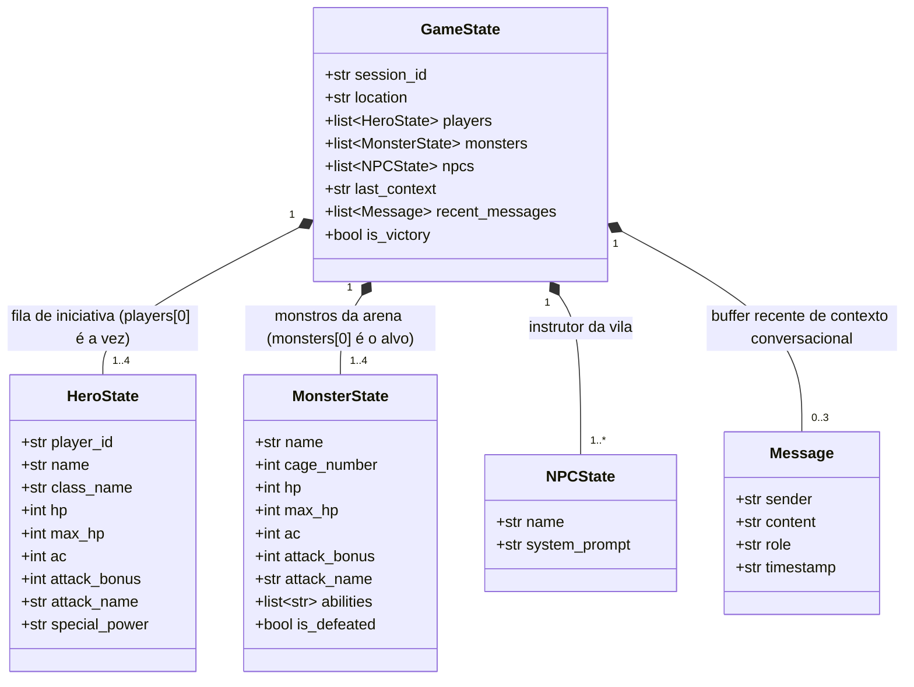
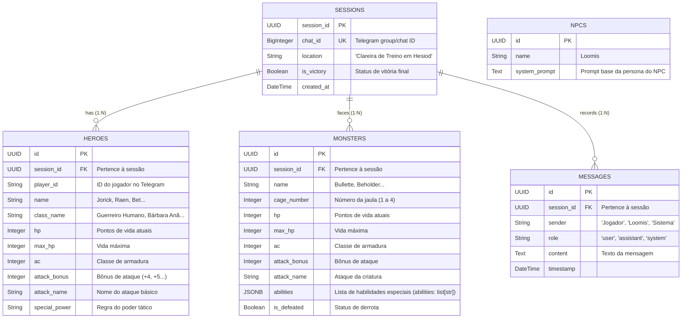
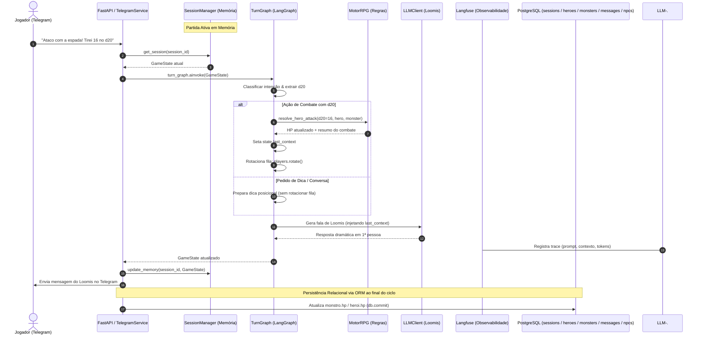
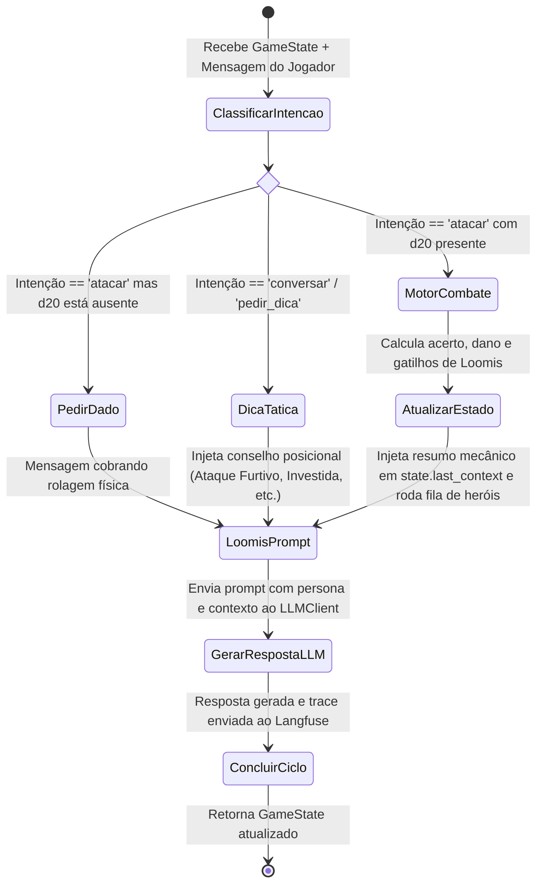

# Arquitetura do Sistema: AI-NPC (The Heroes of Hesiod)

Este documento detalha a arquitetura de ponta a ponta, a modelagem de domínio orientada a DDD (Domain-Driven Design), os princípios SOLID aplicados e o ciclo de vida dos fluxos do sistema de NPC Conversacional para Telegram e IA.

---

## 1. Visão Geral e Bounded Contexts (DDD)

O sistema é estruturado em quatro Bounded Contexts com responsabilidades estritamente delimitadas:


```mermaid
flowchart LR
    subgraph BC_Telegram["Bounded Context: Ingress & Interface"]
        TelegramBot["Serviço do Telegram (telegram_bot/)"]
    end

    subgraph BC_MotorRPG["Bounded Context: Motor de Regras (api/motor_rpg/)"]
        RulesEngine["Motor de Regras & Cálculos (d20 + bônus vs CA)"]
        SessionMgr["Gerenciador de Sessões (Memória & Persistência)"]
    end

    subgraph BC_Cognitivo["Bounded Context: Cognição e Diálogo (api/ai_core/)"]
        TurnGraph["Grafo de Turno (LangGraph)"]
        LoomisNPC["Persona do Loomis (LLM Gateway)"]
    end

    subgraph BC_Observabilidade["Bounded Context: Telemetria & Tracing"]
        Langfuse[("Langfuse (Prompts, Tokens & Rastreamento)")]
    end

    subgraph BC_Persistencia["Bounded Context: Persistência Relacional (db/)"]
        PostgreSQL[("PostgreSQL (sessions / heroes / monsters / messages / npcs)")]
    end

    TelegramBot -->|Mensagem / d20 Declarado| SessionMgr
    SessionMgr -->|Dispara Turno com GameState| TurnGraph
    TurnGraph -->|Consulta Validações e Cálculos| RulesEngine
    TurnGraph -->|Injeta last_context e Persona| LoomisNPC
    LoomisNPC -.->|Tracing e Métricas| Langfuse
    TurnGraph -->|Retorna GameState Atualizado| SessionMgr
    SessionMgr -->|Persiste GameState Consolidado| PostgreSQL
```

### Definição dos Contextos Delimitados:
1. **Contexto de Interface (Telegram):** Recebe webhooks, decodifica remetentes (`chat_id`, `telegram_id`) e despacha mensagens formatadas ao grupo.
2. **Contexto do Motor RPG (Domínio de Regras):** Árbitro determinístico das regras oficiais de Hesiod (validação de dados físicos, armaduras, vida, habilidades especiais dos monstros e poções de Loomis).
3. **Contexto Cognitivo (Domínio de IA):** Modela a cognição e pedagogia do Treinador Loomis via LangGraph, fornecendo dicas posicionais e narrando em 1ª pessoa a partir do contexto mecânico efêmero.
4. **Contexto de Observabilidade (Langfuse):** Rastreia execuções, metadados de jogadas (dados informados, acertos/erros, latências e custos de tokens) sem poluir as tabelas do banco de dados operacional.
5. **Contexto de Persistência:** Armazenamento relacional e documental do `GameState` agregado no PostgreSQL.

---

## 2. Modelagem de Domínio (Domain Model & SOLID)

Seguindo DDD e o princípio da responsabilidade única (SRP), o modelo distingue o **Aggregate Root (`GameState`)** e suas **Entidades filhas ricas e auto-contidas**:


```mermaid
classDiagram
    class GameState {
        +str session_id
        +str location
        +list~HeroState~ players
        +list~MonsterState~ monsters
        +list~NPCState~ npcs
        +str last_context
        +list~Message~ recent_messages
        +bool is_victory
    }

    class HeroState {
        +str player_id
        +str name
        +str class_name
        +int hp
        +int max_hp
        +int ac
        +int attack_bonus
        +str attack_name
        +str special_power
    }

    class MonsterState {
        +str name
        +int cage_number
        +int hp
        +int max_hp
        +int ac
        +int attack_bonus
        +str attack_name
        +list~str~ abilities
        +bool is_defeated
    }

    class NPCState {
        +str name
        +str system_prompt
    }

    class Message {
        +str sender
        +str content
        +str role
        +str timestamp
    }

    GameState "1" *-- "1..4" HeroState : fila de iniciativa (players[0] é a vez)
    GameState "1" *-- "1..4" MonsterState : monstros da arena (monsters[0] é o alvo)
    GameState "1" *-- "1..*" NPCState : instrutor da vila
    GameState "1" *-- "0..3" Message : buffer recente de contexto conversacional
```

### Responsabilidades dos Elementos de Domínio:
* **`GameState` (Aggregate Root):** O estado consolidado do tabuleiro. Não possui campos redundantes (`current_turn`, `active_player_id`):
  * **Fila de Iniciativa:** A própria lista `players` atua como fila circular. O herói ativo é sempre `players[0]`. Ao finalizar a jogada de ataque, a fila rotaciona (`players.append(players.pop(0))`).
  * **Monstro Ativo:** É sempre `monsters[0]`.
  * **`last_context`:** Campo transitório que armazena a string com o resumo mecânico da jogada apenas para alimentar o prompt do Loomis.
  * **`recent_messages`:** Buffer deslizante das últimas 3 mensagens mantido para preservar a fluidez de diálogos continuados.
* **`HeroState` e `MonsterState` (Entidades Ricas):** Carregam seus atributos mecânicos e regras especiais (`special_power`, `abilities`) de forma auto-contida, facilitando o acesso direto pela IA e pelas telas de onboarding.
* **Sem `TurnRecord`:** Eliminou-se a classe `TurnRecord`. Os eventos e auditorias analíticas passam a ser rastreados de forma desacoplada no **Langfuse**.

### 2.1. Modelo Físico de Banco de Dados (PostgreSQL Relacional Normalizado)

Em alinhamento com a arquitetura explícita, o banco de dados reflete **literalmente e campo a campo** as entidades do domínio, eliminando colunas opacas de JSONB (`variaveis_jogo`) e inconsistências de nomenclatura:


```mermaid
erDiagram
    SESSIONS ||--o{ HEROES : "has (1:N)"
    SESSIONS ||--o{ MONSTERS : "faces (1:N)"
    SESSIONS ||--o{ MESSAGES : "records (1:N)"

    SESSIONS {
        UUID session_id PK
        BigInteger chat_id UK "Telegram group/chat ID"
        String location "'Clareira de Treino em Hesiod'"
        Boolean is_victory "Status de vitória final"
        DateTime created_at
    }

    HEROES {
        UUID id PK
        UUID session_id FK "Pertence à sessão"
        String player_id "ID do jogador no Telegram"
        String name "Jorick, Raen, Bet..."
        String class_name "Guerreiro Humano, Bárbara Anã..."
        Integer hp "Pontos de vida atuais"
        Integer max_hp "Vida máxima"
        Integer ac "Classe de armadura"
        Integer attack_bonus "Bônus de ataque (+4, +5...)"
        String attack_name "Nome do ataque básico"
        String special_power "Regra do poder tático"
    }

    MONSTERS {
        UUID id PK
        UUID session_id FK "Pertence à sessão"
        String name "Bullette, Beholder..."
        Integer cage_number "Número da jaula (1 a 4)"
        Integer hp "Pontos de vida atuais"
        Integer max_hp "Vida máxima"
        Integer ac "Classe de armadura"
        Integer attack_bonus "Bônus de ataque"
        String attack_name "Ataque da criatura"
        JSONB abilities "Lista de habilidades especiais (abilities: list[str])"
        Boolean is_defeated "Status de derrota"
    }

    MESSAGES {
        UUID id PK
        UUID session_id FK "Pertence à sessão"
        String sender "'Jogador', 'Loomis', 'Sistema'"
        String role "'user', 'assistant', 'system'"
        Text content "Texto da mensagem"
        DateTime timestamp
    }

    NPCS {
        UUID id PK
        String name "Loomis"
        Text system_prompt "Prompt base da persona do NPC"
    }
```

#### Vantagens do Modelo Relacional Literal 1:1:
1. **Espelhamento 100% Literal com os States do Pydantic:**
   * `HeroState` $\leftrightarrow$ Tabela `heroes`
   * `MonsterState` $\leftrightarrow$ Tabela `monsters`
   * `Message` $\leftrightarrow$ Tabela `messages`
   * `NPCState` $\leftrightarrow$ Tabela `npcs` (apenas `name` e `system_prompt`)
   * `GameState` $\leftrightarrow$ `sessions` + coleções filhas consultadas por `session_id`.
   * **Sem campos inventados:** Heróis não carregam colunas artificiais como `ordem_iniciativa` — a fila de turnos é a própria ordem da lista `players` em memória.
2. **Consultas Simples e Rápidas (Zero JOINs Mirabolantes):**
   * Carregar heróis da sessão: `db.query(Hero).filter_by(session_id=session_id).all()`
   * Carregar monstro ativo: `db.query(Monster).filter_by(session_id=session_id, is_defeated=False).first()`
3. **Persistência Limpa via Dirty-Tracking do SQLAlchemy:**
   * Para aplicar o dano do turno:
     ```python
     monster.hp = new_hp
     if monster.hp == 0:
         monster.is_defeated = True
     db.commit() # O ORM executa o UPDATE pontual na coluna hp
     ```
4. **Fácil Extensibilidade para Novas Histórias/Campanhas:**
   * Permite queries analíticas diretas em SQL para métricas e relatórios do professor.
   * Adicionar novas campanhas, monstros ou regras no futuro é modular e não quebra uma estrutura monolítica.

---

## 3. Dinâmica de Ciclo de Vida: Memória vs. Banco de Dados

Para evitar sobrecarga de transações no banco a cada micro-interação e garantir performance em tempo real no Telegram:


```mermaid
sequenceDiagram
    autonumber
    actor Jogador as Jogador (Telegram)
    participant API as FastAPI / TelegramService
    participant Session as SessionManager (Memória)
    participant Graph as TurnGraph (LangGraph)
    participant Motor as MotorRPG (Regras)
    participant LLM as LLMClient (Loomis)
    participant LF as Langfuse (Observabilidade)
    participant DB as PostgreSQL (sessions / heroes / monsters / messages / npcs)

    Note over Session: Partida Ativa em Memória
    Jogador->>API: "Ataco com a espada! Tirei 16 no d20"
    API->>Session: get_session(session_id)
    Session-->>API: GameState atual
    
    API->>Graph: turn_graph.ainvoke(GameState)
    Graph->>Graph: Classificar intenção & extrair d20
    
    alt Ação de Combate com d20
        Graph->>Motor: resolve_hero_attack(d20=16, hero, monster)
        Motor-->>Graph: HP atualizado + resumo do combate
        Graph->>Graph: Seta state.last_context
        Graph->>Graph: Rotaciona fila: players.rotate()
    else Pedido de Dica / Conversa
        Graph->>Graph: Prepara dica posicional (sem rotacionar fila)
    end

    Graph->>LLM: Gera fala de Loomis (injetando last_context)
    LLM-->>Graph: Resposta dramática em 1ª pessoa
    LLM-.->LF: Registra trace (prompt, contexto, tokens)
    
    Graph-->>API: GameState atualizado
    API->>Session: update_memory(session_id, GameState)
    API->>Jogador: Envia mensagem do Loomis no Telegram

    Note over API,DB: Persistência Relacional via ORM ao final do ciclo
    API->>DB: Atualiza monstro.hp / heroi.hp (db.commit)
```

---

## 4. Dinâmica de Jogo: Regras Oficiais de Hesiod

O sistema opera orientado às regras canônicas de *The Heroes of Hesiod*:

### 4.1. Onboarding e Escolha de Personagens
1. **Comando `/start`:** Loomis dá as boas-vindas na clareira e apresenta os arquétipos:
   * **Jorick (#3):** Guerreiro Humano (CA 13, HP 5, +4 ataque). *Investida:* +2 se começar longe.
   * **Raen (#2):** Bárbara Anã (CA 9, HP 7, +5 ataque). *Guerreira Feroz:* Empurra 2 casas ao ser atingida.
   * **Bet (#5):** Maga Elfa (CA 7, HP 4, +7 ataque à distância). *Onda Explosiva:* Dano em área em monstros adjacentes.
   * **Evindol (#1):** Ladino Humano (CA 11, HP 3, +6 ataque). *Ataque Furtivo:* Dano dobrado ao flanquear.
   * **Yarrow (#4):** Xamã Meio-Orc (CA 10, HP 6, +3 ataque). *Grilhões Espectrais:* Prende a criatura ao errar golpe.
2. **Regra Básica do d20:** Os jogadores são instruídos a rolar seus próprios dados físicos e informar o valor. O PDF pode ser enviado como manual complementar.

### 4.2. Início do Combate: "Monsters First"
* De acordo com as regras canônicas do livro, **o monstro sempre age primeiro**:
  1. Ao abrir a jaula, o monstro desfere imediatamente sua primeira investida na clareira.
  2. A primeira mensagem que o grupo recebe já narra o ataque da criatura (focando no herói de maior HP).
  3. A vez é então passada para o primeiro herói da fila (`players[0]`), que já reage à ameaça em andamento.

### 4.3. Resolução de Ações e Dicas Livres
* **Dica Tática (Ação Livre):** O herói pode conversar e pedir conselhos a Loomis a qualquer momento. Isso não consome seu turno e não roda a fila de heróis.
* **Ataque com d20 Físico:** O motor valida o valor informado pelo jogador:
  * Se o d20 não for informado, Loomis cobra a rolagem em personagem e aguarda.
  * Com o dado, calcula `d20 + bonus >= CA` e desconta o HP.
  * A fila de heróis avança para o próximo recruta.
* **Nova Rodada:** Quando todos os heróis agirem, o monstro inicia a rodada seguinte com um novo ataque.

### 4.4. Regras Especiais de Hesiod
* **Poção Mágica de Loomis (Zero Frustração):** Quando o HP de um herói atinge 0, ele cai inconsciente. Loomis interrompe a luta, arremessa a poção sabor menta e limão e restaura a vida máxima do herói imediatamente. Ninguém morre na clareira.
* **Gatilho de 50% de HP:** Se a criatura cair para a metade da vida ou menos (e for a única na arena), Loomis destranca a jaula seguinte como surpresa tática.
* **Vitória:** Ao derrotar o Enxame de Pixies da Jaula 4, Loomis concede as insígnias oficiais de **Herói de Hesiod**.

---

## 5. Ciclo Cognitivo no LangGraph (`turn_graph.py`)

A execução de cada requisição no LangGraph segue a máquina de estados:


```mermaid
stateDiagram-v2
    [*] --> ClassificarIntencao : Recebe GameState + Mensagem do Jogador
    
    state checagem_intencao <<choice>>
    ClassificarIntencao --> checagem_intencao
    
    checagem_intencao --> DicaTatica : Intenção == 'conversar' / 'pedir_dica'
    checagem_intencao --> PedirDado : Intenção == 'atacar' mas d20 está ausente
    checagem_intencao --> MotorCombate : Intenção == 'atacar' com d20 presente
    
    PedirDado --> LoomisPrompt : Mensagem cobrando rolagem física
    DicaTatica --> LoomisPrompt : Injeta conselho posicional (Ataque Furtivo, Investida, etc.)
    
    MotorCombate --> AtualizarEstado : Calcula acerto, dano e gatilhos de Loomis
    AtualizarEstado --> LoomisPrompt : Injeta resumo mecânico em state.last_context e roda fila de heróis
    
    LoomisPrompt --> GerarRespostaLLM : Envia prompt com persona e contexto ao LLMClient
    GerarRespostaLLM --> ConcluirCiclo : Resposta gerada e trace enviada ao Langfuse
    ConcluirCiclo --> [*] : Retorna GameState atualizado
```

### Responsabilidade dos Nós:
* **`classify_intent_node`:** Identifica se a mensagem é diálogo/dica ou ataque, e extrai o valor numérico do d20 caso declarado.
* **`tactical_advice_node`:** Lê o `hero.special_power` do herói ativo e `monster.abilities` do monstro atual e prepara o conselho tático (ação livre).
* **`combat_node`:** Aplica o cálculo matemático das regras (d20 informado + bônus versus CA, crítico, gatilho de poção e destrancamento de jaula). Preenche `state.last_context` e rotaciona `state.players`.
* **`npc_node` (Loomis):** Sintetiza a resposta em 1ª pessoa no tom encorajador e pragmático do treinador, utilizando o `last_context` e o histórico de mensagens recentes.
