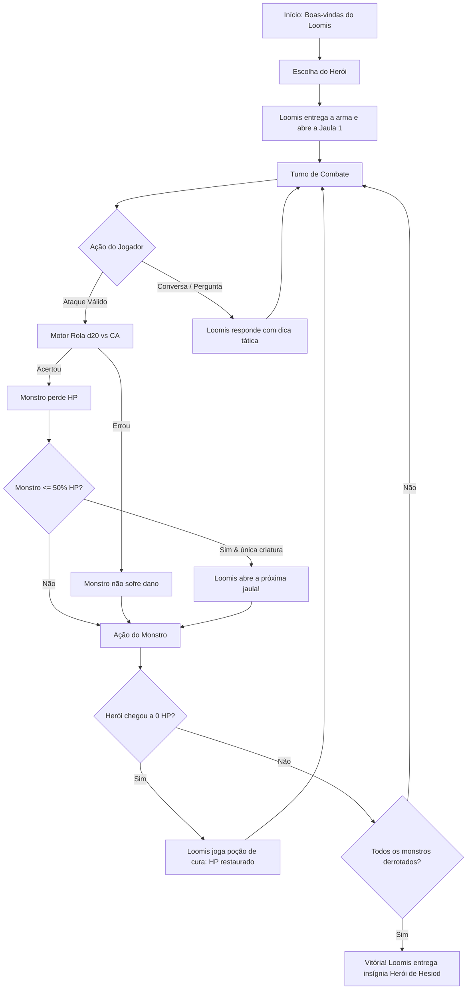

# Documento de Game Design & Regras do RPG: The Heroes of Hesiod

Este documento detalha o cenário, regras, papéis e árvore de decisão para a adaptação de *Monster Slayers: The Heroes of Hesiod* no sistema de NPC Conversacional para Telegram.

---

## 1. História e Ambientação

* **Cenário:** A vila de **Hesiod**, um povoado constantemente ameaçado por monstros. Mesmo quem deseja apenas cuidar de porcos ou trabalhar na lavoura precisa aprender a lutar para sobreviver.
* **O Local de Treino:** Uma clareira atrás de uma cabana isolada na floresta, onde todos os anos os jovens da vila passam pelo teste final de combate após três meses de preparação básica.
* **O NPC (Loomis):**
  * Treinador da vila há quase uma década.
  * Forte, com traços evidentes de sangue de ogro, mas com uma voz estranhamente aguda e anasalada.
  * Personalidade: Pragmático, enérgico, exigente e encorajador. Ele não tolera covardia, mas cuida dos alunos e nunca deixa ninguém morrer de verdade.
  * **Voz no Telegram:** Fala em **primeira pessoa**, acolhendo o aluno, entregando armas, abrindo as jaulas, comentando os golpes e jogando poções de cura quando o aluno cai inconsciente.

---

## 2. Heróis Disponíveis (Escolha do Jogador)

O jogador escolhe um dos cinco arquétipos clássicos simplificados:

| Herói | Classe | CA (Armadura) | HP (Vida) | Poder de Ataque | Poder Especial |
| :--- | :--- | :---: | :---: | :--- | :--- |
| **Jorick** | Guerreiro Humano | 13 | 5 | Espada Larga (`1d20 + 4`, 1 dano) | **Investida:** +2 no ataque se começar longe do monstro. |
| **Raen** | Bárbara Anã | 9 | 7 | Machado Pesado (`1d20 + 5`, 1 dano) | **Guerreira Feroz:** Empurra o monstro 2 casas ao ser atingida. |
| **Bet** | Maga Elfa | 7 | 4 | Bola de Fogo (`1d20 + 7`, 1 dano à distância) | **Onda Explosiva:** Chance de acertar monstros adjacentes. |
| **Evindol** | Ladino Humano | 11 | 3 | Lâminas Giratórias (`1d20 + 6`, 1 dano) | **Ataque Furtivo:** Dobro de dano (2) se flanquear o inimigo. |
| **Yarrow** | Xamã Meio-Orc | 10 | 6 | Espíritos Vingativos (`1d20 + 3`, 1 dano) | **Grilhões Espectrais:** Prende o monstro ao solo se errar o ataque. |

* **Acerto Crítico:** Um 20 natural no d20 causa `1d6` pontos de dano em vez de apenas 1.

---

## 3. Os Monstros das 4 Jaulas

Loomis mantém quatro criaturas enjauladas na clareira:

1. **Jaula 1 - Bullette Faminto:**
   * CA: 15 | HP: 8
   * Habilidades: Escava o solo e tenta engolir o herói (dano de ácido de estômago).
2. **Jaula 2 - Beholder Ameaçador:**
   * CA: 12 | HP: 11
   * Habilidades: Flutua, dispara raios oculares e mordida mortal.
3. **Jaula 3 - Dragão Vermelho Jovem:**
   * CA: 14 | HP: 10
   * Habilidades: Sopro de fogo e mordida flamejante.
4. **Jaula 4 - Enxame de Pixies Ferais:**
   * CA: 10 | HP: 11
   * Habilidades: Criaturas diminutas e elétricas que atacam em bando veloz.

---

## 4. Mecânicas e Regras do Motor RPG (Determinístico)

O Motor RPG (em Python) é o árbitro matemático das regras:

1. **Ciclo de Turno e Multiplayer (1 a 4 Jogadores):**
   * **Iniciativa:** Os herois agem em ordem de participacao no grupo do Telegram.
   * **Turno Encadeado:** Quando o heroi da vez escolhe sua acao (atacar, usar poder especial ou conversar):
     * O motor calcula a rolagem do heroi: `d20 + bonus >= CA_alvo`. Se acertar, subtrai dano do monstro.
     * Se o monstro permanecer vivo apos o golpe, a criatura executa imediatamente o seu contra-ataque contra um dos herois ativos.
     * O resultado completo (golpe do heroi + revide do monstro) e sintetizado na narrativa do Loomis em 1a pessoa, passando a vez ao proximo heroi.
2. **Gatilhos Especiais do Loomis:**
   * **Monstro em 50% de HP:** Se houver apenas um monstro na clareira e ele cair para metade da vida ou menos, Loomis destranca e abre a jaula seguinte como desafio extra.
   * **Heroi com 0 HP:** O heroi cai inconsciente. Loomis interrompe a luta, arremessa uma pocao com sabor de menta e limao e restaura a vida maxima do heroi (`loomis_potion_used = True`). O aluno se levanta pronto para continuar sem perder a vez.
   * **Todas as jaulas vazias / monstros derrotados:** Loomis parabeniza o grupo e concede a insignia oficial de **Heroi de Hesiod**.

---

## 5. Árvore de Decisão do Jogo

---

## 6. Divisão de Responsabilidades no Sistema
 
 * **Motor RPG (`api/motor_rpg/`):**
   * Controla os dados, classes, pontos de vida, cálculos matemáticos de acerto/dano, contra-ataque do monstro e a árvore de decisão determinística.
 * **LangGraph e Estado (`api/ai_core/` e `api/schemas/`):**
   * `GameState`: Mantem o estado consolidado da sessao (herois, fila de monstros, jaula atual, turns_history e buffer de recent_messages).
   * `TurnRecord`: Registra o fato do turno resolvido deterministicamente pelo motor.
   * **Nó Loomis (LLM):** Transforma os números calculados pelo motor em diálogos vivos, imersivos e em primeira pessoa no Telegram.

