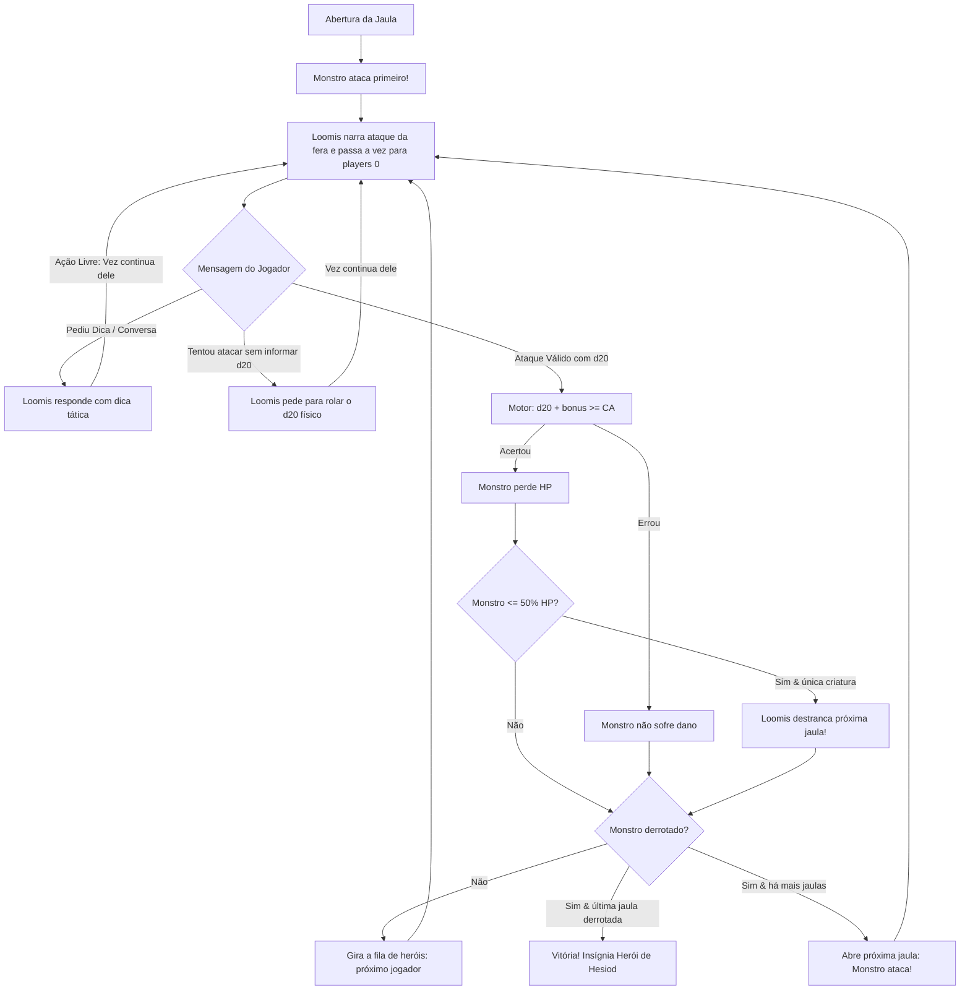

# Documento de Game Design & Regras do RPG: The Heroes of Hesiod

Este documento detalha o cenário, regras oficiais (baseadas no livro *Monster Slayers: The Heroes of Hesiod*), papéis e árvore de decisão para a adaptação no sistema de NPC Conversacional para Telegram.

---

## 1. História e Ambientação

* **Cenário:** A vila de **Hesiod**, um povoado constantemente ameaçado por monstros. Mesmo quem deseja apenas cuidar de porcos ou trabalhar na lavoura precisa aprender a lutar para sobreviver.
* **O Local de Treino:** Uma clareira atrás de uma cabana isolada na floresta, onde todos os anos os jovens da vila passam pelo teste final de combate após três meses de preparação básica.
* **O NPC (Loomis):**
  * Treinador da vila há quase uma década.
  * Forte, com traços evidentes de sangue de ogro, mas com uma voz estranhamente aguda e anasalada.
  * Personalidade: Pragmático, enérgico, exigente e encorajador. Ele não tolera covardia, mas cuida dos alunos e nunca deixa ninguém morrer de verdade.
  * **Voz no Telegram:** Fala em **primeira pessoa**, acolhendo os recrutas, entregando armas, abrindo as jaulas, comentando os golpes e jogando poções de cura quando o aluno cai inconsciente.

---

## 2. Heróis Disponíveis (Escolha do Jogador)

O jogador escolhe um dos cinco arquétipos clássicos simplificados:

| Herói | Classe | CA (Armadura) | HP (Vida) | Poder de Ataque | Poder Especial (Regra Posicional) |
| :--- | :--- | :---: | :---: | :--- | :--- |
| **Jorick** (#3) | Guerreiro Humano | 13 | 5 | Espada Larga (`1d20 + 4`, 1 dano) | **Investida:** +2 no d20 de ataque se começar distante do monstro (até 7 quadrados). |
| **Raen** (#2) | Bárbara Anã | 9 | 7 | Machado Pesado (`1d20 + 5`, 1 dano) | **Guerreira Feroz:** Empurra o monstro 2 quadrados para trás ao ser atingida. |
| **Bet** (#5) | Maga Elfa | 7 | 4 | Bola de Fogo (`1d20 + 7`, 1 dano à distância até 6 quadrados) | **Onda Explosiva:** Ao acertar, rola d20 (10+) para causar 1 de dano em monstros adjacentes. |
| **Evindol** (#1) | Ladino Humano | 11 | 3 | Lâminas Giratórias (`1d20 + 6`, 1 dano) | **Ataque Furtivo:** Causa dano dobrado (2 pontos) se flanquear (aliado do lado oposto). |
| **Yarrow** (#4) | Xamã Meio-Orc | 10 | 6 | Espíritos Vingativos (`1d20 + 3`, 1 dano) | **Grilhões Espectrais:** Se errar o ataque, rola d20 (11+) para prender o monstro no chão. |

* **Acerto Crítico:** Um 20 natural no d20 causa `1d6` pontos de dano em vez de apenas 1 (ou `2d6` se Evindol acertar um crítico sob Ataque Furtivo).

---

## 3. Os Monstros das 4 Jaulas

Loomis mantém quatro criaturas enjauladas na clareira:

1. **Jaula 1 - Bullette Faminto:**
   * CA: 15 | HP: 8
   * *Habilidades:* Escava o solo e surge a até 5 quadrados.
   * *Engolir (Swallow):* Engole o herói (causa 1 de dano de ácido estomacal por turno). O herói engolido pode escolher entre atacar por dentro (acerto automático) ou "fazer cócegas" no monstro (`d20 >= 11` para ser cuspido).
2. **Jaula 2 - Beholder Ameaçador:**
   * CA: 12 | HP: 9
   * *Habilidades:* Dispara raios oculares à distância (alcance 6). Possui *Multiple Eyes* (dispara dois raios por rodada).
   * *Tabela de Raios (1d6):* 1: Raio de Fogo; 2: Correntes de Gelo; 3: Vácuo (puxa 2 quadrados); 4: Onda de Choque (empurra 2 quadrados); 5: Raio Elétrico; 6: Olho do Mal (troca de lugar com o herói).
3. **Jaula 3 - Dragão Vermelho Jovem:**
   * CA: 14 | HP: 10
   * *Habilidades:* Sopro de Fogo em área (cone a até 6 quadrados, atinge aliados adjacentes) e *Rabada* (derruba o herói no chão).
4. **Jaula 4 - Enxame de Pixies Ferais:**
   * CA: 10 | HP: 11
   * *Habilidades:* *Glamour* (as fadas entram no quadrado do herói; ele não pode atacá-las enquanto estiverem ali) e *Swarm* (herói toma 1 de dano no início do turno; se um aliado tentar atacar o enxame e rolar `<= 10` no d20, o golpe acerta o herói amigo).

---

## 4. Mecânicas e Regras do Motor RPG

### 4.1 Ordem de Rodada ("Monsters First")
Conforme as regras oficiais do livro:
1. **O Monstro Começa:** Na abertura de uma jaula e no início de cada nova rodada, o monstro age primeiro.
   * *IA do Monstro:* O monstro ataca preferencialmente o herói com maior HP atual e evita focar na mesma vítima duas vezes seguidas.
2. **Vez dos Heróis:** Os heróis agem na ordem de sua fila de iniciativa (`players[0]`, `players[1]`, etc.).
3. **Nova Rodada:** Quando todos os heróis da fila terminam suas ações, o ciclo reinicia com o monstro atacando.

### 4.2 Rolagem do d20 pelo Jogador (Física)
* O jogo **não rola dados aleatórios para os heróis**. Os jogadores usam dados físicos reais na mesa.
* O jogador declara o valor obtido na sua mensagem (ex.: *"Ataquei com minha espada e tirei 15 no dado"*).
* O motor RPG apenas soma o bônus de ataque do herói (`total = d20 + attack_bonus`), compara contra a CA do monstro e aplica o dano correspondente.
* **Falta do Dado:** Se o jogador disser apenas *"Quero atacar"* sem informar o número do dado, Loomis interrompe em personagem cobrando a rolagem, e a vez **não é consumida**.

### 4.3 Dica Tática é Ação Livre
* O jogador pode conversar, pedir conselhos sobre o monstro ou tirar dúvidas táticas com Loomis a qualquer momento.
* Pedir dicas **não gasta o turno de combate** e **não avança a fila de heróis**.

### 4.4 Sem Tabuleiro Virtual (Teatro da Mente e Tutoria de Loomis)
* O sistema não processa coordenadas virtuais `(x, y)` nem movimentação em grade.
* Os jogadores gerenciam seu posicionamento na mesa física ou na imaginação.
* O Loomis atua como **Tutor Tático Ativo**: ele relembra as regras posicionais do PDF (investida de longe para Jorick, flanquear pelas costas para Evindol, recuo para Bet, etc.) quando o jogador pede dicas ou antes dos golpes.

### 4.5 Gatilhos Especiais de Hesiod
1. **Monstro em 50% de HP:** Se houver apenas um monstro na clareira e ele cair para a metade da vida ou menos, Loomis destranca a próxima jaula como desafio extra surpresa.
2. **Herói com 0 HP:** O herói cai inconsciente. Loomis arremessa sua poção com sabor de menta e limão restaurando a vida máxima do herói imediatamente. Ninguém morre no treinamento de Hesiod.
3. **Vitória Final:** Quando todas as 4 jaulas forem superadas, Loomis encerra o treino e entrega a insígnia oficial de **Herói de Hesiod**.

---

## 5. Árvore de Decisão do Jogo

```mermaid
graph TD
    A[Abertura da Jaula] --> B[Monstro ataca primeiro!]
    B --> C[Loomis narra ataque da fera e passa a vez para players 0]
    
    C --> D{Mensagem do Jogador}
    
    D -->|Pediu Dica / Conversa| E[Loomis responde com dica tática]
    E -->|Ação Livre: Vez continua dele| C
    
    D -->|Tentou atacar sem informar d20| F[Loomis pede para rolar o d20 físico]
    F -->|Vez continua dele| C
    
    D -->|Ataque Válido com d20| G[Motor: d20 + bonus >= CA]
    
    G -->|Acertou| H[Monstro perde HP]
    G -->|Errou| I[Monstro não sofre dano]
    
    H --> J{Monstro <= 50% HP?}
    J -->|Sim & única criatura| K[Loomis destranca próxima jaula!]
    J -->|Não| L{Monstro derrotado?}
    I --> L
    K --> L
    
    L -->|Não| M[Gira a fila de heróis: próximo jogador]
    L -->|Sim & última jaula derrotada| N[Vitória! Insígnia Herói de Hesiod]
    L -->|Sim & há mais jaulas| O[Abre próxima jaula: Monstro ataca!]
    
    M --> C
    O --> C
```

---

## 6. Divisão de Responsabilidades no Sistema

* **Motor RPG (`api/motor_rpg/`):**
  * Árbitro matemático determinístico.
  * Valida o d20 informado contra a CA do monstro, calcula dano, gerencia HP e gatilhos de Loomis (poção e destrancar jaula).
  * Mantém o catálogo estático de heróis e monstros.
* **LangGraph e Estado (`api/ai_core/` e `api/schemas/`):**
  * `GameState`: Mantém exclusivamente o tabuleiro vivo (`players`, `monsters`, `npcs`, `recent_messages`, `is_victory`). O primeiro jogador da lista (`players[0]`) é sempre o herói ativo.
  * `last_context`: Guarda temporariamente o resumo mecânico da jogada apenas para alimentar o prompt do Loomis.
  * *Sem classes extras de telemetria:* O `TurnRecord` foi removido; a telemetria e rastreamento são delegados ao **Langfuse**.
* **Nó Loomis (LLM):**
  * Persona do treinador em 1ª pessoa.
  * Consome o `last_context` para dramatizar o golpe e a reação dos monstros.
  * Fornece dicas táticas posicionais contextuais para cada classe e monstro conforme o manual de Hesiod.
